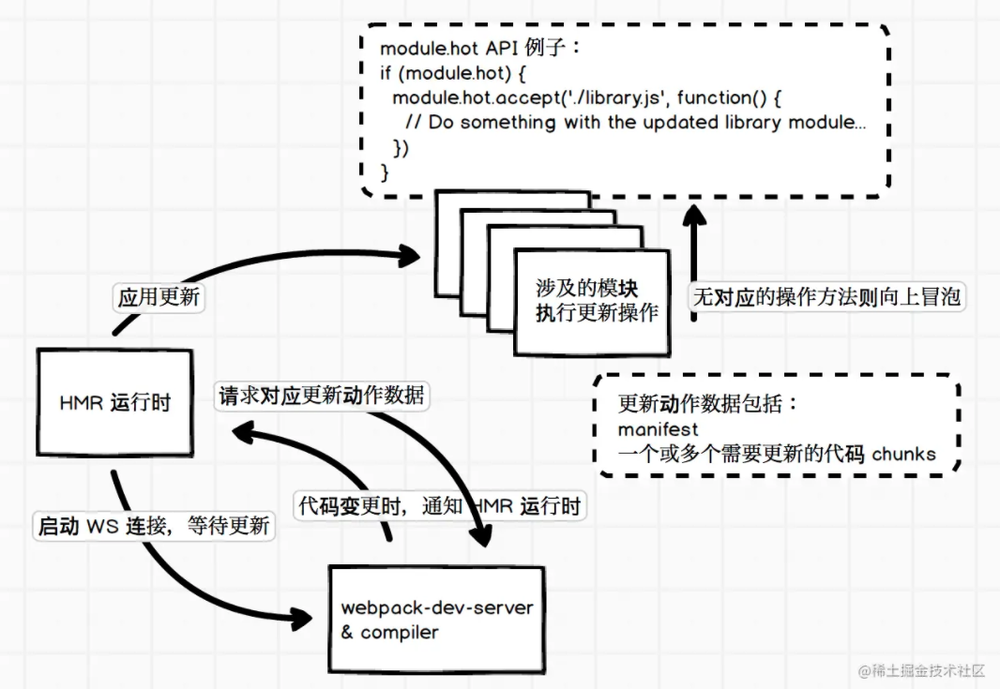

# 模块热替换

模块热替换，即 Hot Module Replacement，简称为 HMR，在这个概念出来之前，我们使用过 Hot Reloading，当代码变更时通知浏览器刷新页面，以避免频繁手动刷新浏览器页面。HMR 可以理解为增强版的 Hot Reloading，但不用整个页面刷新，而是局部替换掉部分模块代码并且使其生效，可以看到代码变更后的效果。所以，HMR 既避免了频繁手动刷新页面，也减少了页面刷新时的等待，可以极大地提高前端页面开发效率。

## 开箱即用

HMR 是 webpack 提供的非常有用的一个功能，在 webpack 的 development mode 下 webpack-dev-server，HMR 就是开箱即用的功能，简单添加一个配置项即可开启：

```
module.exports = {
  // ...
  devServer: {
    hot: true,
  },
}
```

## 运行原理

HMR 的实现和运行相对复杂，需要多个部分协同配合，这里简单地介绍一下 HRM 的运行原理。

首先我们要知道一个概念：webpack 内部运行时，会维护一份用于管理构建代码时各个模块之间交互的表数据，webpack 官方称之为 Manifest，其中包括入口代码文件和构建出来的 bundle 文件的对应关系。可以使用 WebpackManifestPlugin 插件来输出这样的一份数据。

了解这个概念后，我们来看一下 HMR 的大致运行流程图。



开启了 hot 功能的 webpack 会往我们应用的主要代码中添加 WS 相关的代码，用于和服务器保持连接，等待更新动作，这个的实现和 Hot Reloading 类似，本地代码变更时通知浏览器运行时做相应的处理。

webpack 还会往应用代码中添加 HMR 运行时的代码，主要用于定义代码模块应用更新时的 API。

有了这两个部分就可以支持整个 HMR 的功能了。我们先忽略流程图的右上角部分，左下角的流程相对容易理解：当有更新时，webpack-dev-server 发送更新信号给 HMR 运行时，然后 HMR 再请求所需要的更新数据，请求的更新数据没有问题的话就应用更新。

如果 HMR 只是简单替换了代码模块的内容，如替换掉所谓的 installedModules 中需要更新的部分，那么这样并没有办法把更新后的结果实时地在浏览器上显示出来，所以才会需要流程图的右上角部分。

前面提到的 HMR 运行时代码会提供定义代码模块应用更新时执行的 API，这些 API 可以让我们在模块中定义接收到 HMR 更新应用信号时，需要额外做什么工作。例如， style-loader 就需要实现 HMR 接口，当收到更新时，使用新的样式替换掉旧的样式，大概是这样：

```
if (module.hot) {
  module.hot.accept('/some/path', function() {
    // ... 用新样式替换旧样式
  })
}
```

HMR 应用更新时是使用 `webpackHotUpdate` 来处理的：

```
webpackHotUpdate(id, { 
  'modulePath': 
  function() {
    // 模块更新后的代码
  }
})
```

执行 `webpackHotUpdate` 时如发现模块代码实现了 HMR 接口，就会执行相应的回调或者方法，从而达到应用更新时，模块可以自行管理自己所需要额外做的工作。不过，并不是所有的模块都需要做相关的处理，当遇见没有实现 HMR 接口的模块时，就会往上层冒泡，如本节开头部分的流程图所示。

这里还有一个问题是，webpack 如何保证 HMR 接口中的引用是最新的模块代码？我们看一个简单的例子：

```
import './index.css'
import hello from './bar'

hello()

if (module.hot) {
  module.hot.accept('./bar', () => {
    // console.log('Accepting the updated bar module!')
    hello()
  })
}
```

从代码上看，hello 都是同一个，这样的话并没有办法引用最新的模块代码，但是我们看一下上述代码在 webpack 构建后的结果：

```
if (true) {
  module.hot.accept("./src/bar.js", function(__WEBPACK_OUTDATED_DEPENDENCIES__) { 
    /* harmony import */ 
    __WEBPACK_IMPORTED_MODULE_1__bar__ = __webpack_require__("./src/bar.js"); 
    (() => {
      // console.log('Accepting the updated bar module!')
      Object(__WEBPACK_IMPORTED_MODULE_1__bar__["default"])()
    })(__WEBPACK_OUTDATED_DEPENDENCIES__); 
  })
}
```

其他代码比较杂，我们集中看 `module.hot` 的处理部分。这里可以发现，我们的 hello 已经重新使用 `__webpack_require__` 来引用了，所以可以确保它是最新的模块代码。

基本上 HMR 的执行原理就是这样，更具体的实现部分就不展开讲解了。在日常开发中，我们需要更多的工具来帮助我们实现 HMR 的接口，避免编写过多 HMR 需要的代码。

## module.hot

之前已经简单介绍过，module.hot.accept 方法指定在应用特定代码模块更新时执行相应的 callback，第一个参数可以是字符串或者数组，如：

```
if (module.hot) {
  module.hot.accept(['./bar.js', './index.css'], () => {
    // ... 这样当 bar.js 或者 index.css 更新时都会执行该函数
  })
}
```

`module.hot.accept` 也可以用于处理自身的更新，api 的使用和上述差别较大，仅使用一个 callbcak 参数则是处理自身更新，更新时自身模块代码会再执行一次，并且不会通知上层模块，即不会触发上层模块的相关 accept callback。使用例子如下：

```
if (module.hot) {
  module.hot.accept((err) => {
    // 这里是异常回调，当更新异常时调用
  });
}
```

`module.hot.decline` 对于指定的代码模块，拒绝进行模块代码的更新，进入更新失败状态，如 `module.hot.decline('./bar.js')`。这个方法比较少用到，如果不传参数的话，则表明自身模块是不可更新的。

`module.hot.dispose` 用于添加一个处理函数，在当前模块代码被替换时运行该函数，通常用于移除模块之前添加的持久化资源或者相关状态等，例如：

```
if (module.hot) {
  module.hot.dispose((data) => {
    // data 用于传递数据，如果有需要传递的数据可以挂在 data 对象上，然后在模块代码更新后可以通过 module.hot.data 来获取
  });

  // 这里可以通过判断 module.hot.data 来区分该模块是否为更新后的第二次执行
  if (module.hot.data) {
    // ...
  }
}
```

`module.hot.removeDisposeHandler` 用于移除 `dispose` 方法添加的 callback。

