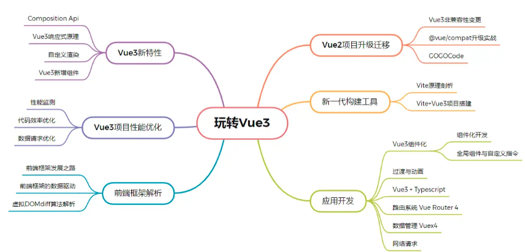

# 通过 Vue3，搭建自己的框架思维

从2020年9月份Vue3.0发布以来，经过一年多的发展补充，Vue3的生态圈逐步完善，已经成熟到足以支撑日常项目的研发。而且，Vue3在Vue2的基础上引入了Typescript重构了大量的代码，增加了很多新的特性，并发布了新一代的工程化工具vite。

## Vue3对研发更友好

让我们来看一下，同样的项目，使用vite作为开发构建工具的Vue3和使用vue-cli的Vue2的运行对比。

| 构建工具 | 启动时间 |	打包时间 |
| ---- | ---- | ---- |
| vite | 135ms | 13025ms |
| vue-cli | 1482ms | 28186ms |

从上面的表格我们可以看到，vite相对比vue-cli来说，启动项目时间缩短达到了10倍，打包时间也明显减小。

同时，Vue3也提高了编译的效率。以往当我们的项目越来越大时，经常是一个小小的改动，甚至需要等待几分钟的编译时间才能看到页面效果。而vite内部使用了Esbuild作为底层的依赖预编译工具，完全发挥了Go语言和多线程的优势，同时利用现代浏览器原生支持ESM特性，完全省略了打包的过程，极大的提高了编译运行的效率。

除了vite这个新工具以外，从代码层面，Vue3的Composition Api新特性也让我们的项目代码功能结构更加清晰，组件拆分复用更加灵活。

从框架层面，Vue3框架的本身也使用proxy代替Object.defineProperty重新实现了真正的响应式“代理”，并且将渲染逻辑拆分为浏览器渲染和平台无关渲染，这对于我们的跨端，跨框架组合开发来说有着非同凡响的意义，你能想象在React中使用Vue的响应式吗，Vue3就替你创造了这个可能性。

Vue3做了如此多的改变，从编译运行、代码语法、框架结构等多个层面同时发力，给研发提供了编译更快、打包体积更小、写法更清晰的直观感受。

通过Vue3.0再次学习的过程，我们可以从原理到基础api，再到vue-router、Vuex的引入，认真体会下Vue3的渐进式设计。

